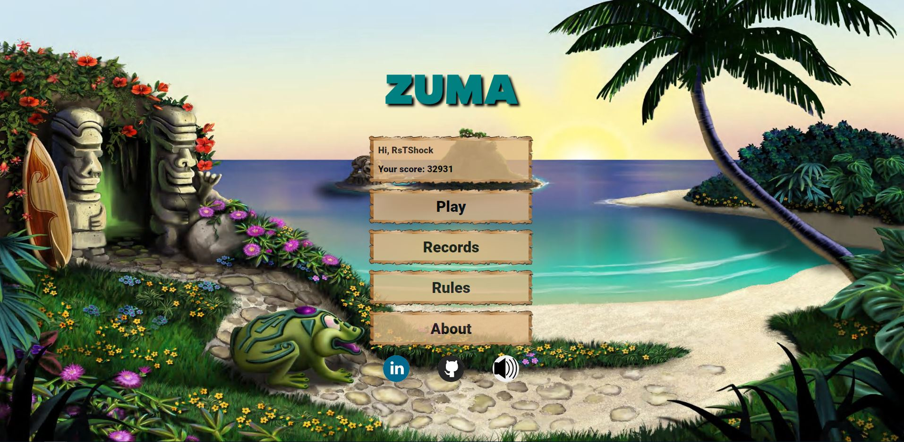
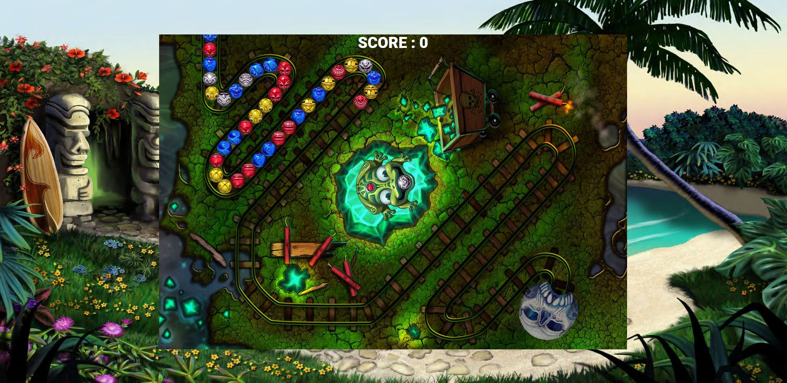

##ZUMA

[Play ZUMA](https://vitaliyrst.github.io/)

>menu

>game

Игра состоит из 9 уровней.
Цель игры сбить все шары.

Играть можно как на ПК, так и на смартфоне.
 - на ПК пкм переключает цвет шарика
 - на смартфоне свайп вниз переключает цвет шарика
 
 
 
### Технологии:
 - MVC. 
   - Model содержат логику и методы для работы с ней. 
   Обновление угла, обновление позиции, обновление размеров при resize.
   
   - View содержат логику и методы для отображения.
   Цвет шаров, анимация спрайтов шаров, анимация полотна, анимация движения шаров.
   
   - Controller содержат методы для управления, передают команды во View для отрисовки, в Model для обновления.
   Содержат различные события (mousemove для вращения лягушки, click для выстрела). При определенных событиях воспроизводят звуки (Начало раунда, победа, поражение, выстрел и т.д.)
   
 - ООП. 
   - все классы написаны в ES6 синтаксисе используется export/import
   
 - Ajax 
   - используется для таблицы рекордов.
   
 - LocalStorage 
   - текущий уровень
   - очки
   - звук вкл\выкл
   - имя игрока
   
 - Адаптивность
   - flex + media выражения
   - для адаптивности полотна Canvas используются константы
   
 
 Графические построения по кривым Безье и параметризацией длины дуги.
 
 Предзагрузка игры с помощью async\await (предзагрузка изображений, получение таблицы рекордов) 
 